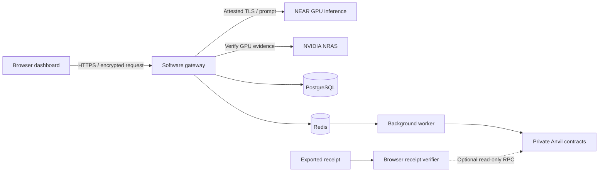

# Architecture

Enclave combines a browser dashboard, an inference gateway, background workers and EVM contracts. The hosted pilot runs the gateway and its supporting services on one ordinary Debian VPS. NEAR provides remote GPU inference.

## What each component does

| Component | Responsibility |
| --- | --- |
| Browser | Encrypt prompts, confirm development payments, display output and persistent history, export receipts |
| API gateway | Authenticate API keys, enforce request and payment rules, verify provider evidence, execute inference and sign receipts |
| NEAR verifier | Check Intel TDX and NVIDIA GPU evidence, reviewed measurements, freshness, TLS binding and provider signatures |
| PostgreSQL and Redis | Persist application state and coordinate background work |
| Worker | Anchor receipts, index chain events and recover background operations |
| Contracts | Apply model policies, verify receipts and handle the configured development payment flow |
| Receipt verification page | Check a signature locally; optionally query contracts and a supplied anchor transaction |

## Trust boundaries

**Browser to gateway.** Request encryption terminates at the gateway. In the pilot, the host operator can access the gateway's process memory, prompts and signing keys. TLS and application encryption do not protect those values from the VPS operator.

**Gateway to provider.** The NEAR adapter verifies remote CPU/GPU evidence and the provider connection against an operator-reviewed policy. This evidence describes the remote model deployment, not Enclave's gateway. Unavailable verification or rejected evidence stops the request; it does not select an unverified fallback.

**Receipt to chain.** A valid signature establishes that the configured signer signed the receipt. It does not by itself prove the signer ran in a TEE. The optional chain check evaluates the selected contract, model policy and anchor at the displayed block. Trusted signer and contract settings must come from an independently approved deployment record.

**Payments.** The pilot uses MockUSDC on private Anvil chain 31337. NEAR credits are billed separately. A local test-token transfer is not a real USDC payment or proof that the provider completed inference.

## Production requirements

The gateway needs confidential execution, measurement-bound key release and tested recovery before its hardware-backed production claim can be made. Production also requires the selected public network, real USDC, user authentication and acceptance on the deployed path. See [E1 acceptance](e1-release.md).
