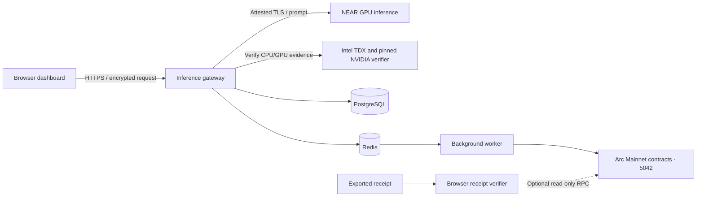

# Architecture

Enclave combines a browser dashboard, an inference gateway, background workers and EVM contracts. NEAR provides the selected GPU inference path.

```mermaid
flowchart LR
    Browser[Browser dashboard] -->|HTTPS / encrypted request| Gateway[Inference gateway]
    Gateway -->|Attested TLS / prompt| NEAR[NEAR GPU inference]
    Gateway -->|Verify CPU/GPU evidence| Verifier[Intel TDX and pinned NVIDIA verifier]
    Gateway --> DB[(PostgreSQL)]
    Gateway --> Queue[(Redis)]
    Queue --> Worker[Background worker]
    Worker --> Chain[Arc Mainnet contracts · 5042]
    Receipt[Exported receipt] --> Verify[Browser receipt verifier]
    Verify -. Optional read-only RPC .-> Chain
```

## What each component does

| Component | Responsibility |
| --- | --- |
| Browser | Connect a wallet, sign in, encrypt prompts, authorize USDC payments, display output and owner history, export receipts |
| API gateway | Authenticate wallet sessions and operator API keys, enforce request and payment rules, verify provider evidence, execute inference and sign receipts |
| NEAR verifier | Check Intel TDX and NVIDIA GPU evidence, reviewed measurements, freshness, TLS binding and provider signatures |
| PostgreSQL and Redis | Persist application state and coordinate background work |
| Worker | Anchor receipts, index chain events and recover background operations |
| Contracts | Apply ModelRegistry policies, verify and anchor receipts, settle authorized USDC payments and distribute fees |
| Receipt verification page | Check a signature locally; optionally query contracts and a supplied anchor transaction |

## Trust boundaries

**Browser to gateway.** Request encryption terminates at the application gateway. NEAR evidence describes the remote model execution path, not this application process.

**Gateway to provider.** The NEAR adapter verifies remote CPU/GPU evidence and the provider connection against an operator-reviewed policy. This evidence describes the remote model deployment. Unavailable verification or rejected evidence stops the request; it does not select an unverified fallback.

**Receipt to chain.** A valid signature establishes that the configured signer signed the receipt. It does not by itself prove the signer ran in a TEE. The optional chain check evaluates the selected contract, model policy and anchor at the displayed block. Trusted signer and contract settings must come from an independently approved deployment record.

**Payments.** The hosted deployment accepts real USDC on Arc Mainnet, chain 5042, at the approved price of 0.10 USDC per request. Wallet sign-in and payment authorization are separate signatures. Durable payment and inference journals prevent repeating an ambiguous execution. The local development launcher uses test funds on Anvil; its records remain separate from Arc. NEAR provider credits are billed separately from customer settlement.

## Production release

The hosted backend runs the accepted NEAR + Arc production profile. The selected provider route is experimental direct NEAR, with fresh CPU/GPU verification, attested TLS and signed request/response transcripts. Production startup verifies the reviewed release archive, current provider evidence and contract bindings. The reviewed provider policy expires on 8 October 2026 at 14:29:11 UTC; renewal requires another explicit review and accepted archive.

See [release progress](release-progress.md) for confirmed payments and receipt anchors, and [E1 acceptance](e1-release.md) for the remaining live failure scenarios. Hardware claims are limited to the remote NEAR evidence verified for each request.
