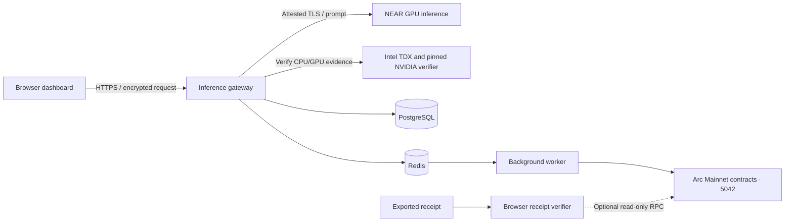

# Architecture

Enclave combines a browser dashboard, an inference gateway, background workers and EVM contracts. NEAR provides the selected GPU inference path.

```mermaid
flowchart LR
    Browser[Browser dashboard] -->|HTTPS / encrypted request| Gateway[Inference gateway]
    Gateway -->|Attested TLS / prompt| NEAR[NEAR GPU inference]
    Gateway -->|Verify CPU/GPU evidence| Verifier[Intel TDX and pinned NVIDIA verifier]
    Gateway --> DB[(PostgreSQL)]
    Gateway --> Queue[(Redis)]
    Queue --> Worker[Background worker]
    Worker --> Chain[Arc Mainnet contracts · 5042]
    Receipt[Exported receipt] --> Verify[Browser receipt verifier]
    Verify -. Optional read-only RPC .-> Chain
```

## What each component does

| Component | Responsibility |
| --- | --- |
| Browser | Connect a wallet, sign in, encrypt prompts, authorize USDC payments, display output and owner history, export receipts |
| API gateway | Authenticate wallet sessions and operator API keys, enforce request and payment rules, verify provider evidence, execute inference and sign receipts |
| NEAR verifier | Check Intel TDX and NVIDIA GPU evidence, reviewed measurements, freshness, TLS binding and provider signatures |
| PostgreSQL and Redis | Persist application state and coordinate background work |
| Worker | Anchor receipts, index chain events and recover background operations |
| Contracts | Apply ModelRegistry policies, verify and anchor receipts, settle authorized USDC payments and distribute fees |
| Receipt verification page | Check a signature locally; optionally query contracts and a supplied anchor transaction |

## Trust boundaries

**Browser to gateway.** Request encryption terminates at the application gateway, which decrypts requests before forwarding them. Gateway keys are software-managed; remote NEAR evidence does not isolate this process from its operator.

**Gateway to provider.** The NEAR adapter verifies remote CPU/GPU evidence and the provider connection against an operator-reviewed policy. This evidence describes the remote model deployment. Unavailable verification or rejected evidence stops the request; it does not select an unverified fallback.

**Receipt to chain.** A valid signature establishes that the configured signer signed the receipt. It does not by itself prove the signer ran in a TEE. The optional chain check evaluates the selected contract, model policy and anchor at the displayed block. Trusted signer and contract settings must come from an independently approved deployment record.

**Payments.** The hosted deployment is configured for real USDC on Arc Mainnet, chain 5042, at the approved price of 0.10 USDC per request. A fresh operator EOA request passed settlement, complete model response, receipt and confirmed anchor under reviewed provider policy v6 on 4 October 2026. Wallet sign-in and payment authorization are separate signatures. Arc payment amounts and addresses are public. Shielded transfers and the hosted sealed-agent runtime are not enabled. Durable payment and inference journals prevent repeating an ambiguous execution. The local development launcher uses test funds on Anvil; its records remain separate from Arc. NEAR provider credits are billed separately from customer settlement.

## Production release

The hosted backend runs in production mode with an accepted NEAR + Arc release manifest and reviewed provider policy v6 installed on 4 October 2026. The selected provider route remains experimental direct NEAR, requiring fresh CPU/GPU verification, attested TLS and signed request/response transcripts. Archived evidence and fresh provider startup checks passed; public HTTPS health reported backend and provider readiness at 10:05 UTC on that date. The policy expires on 8 October 2026 at 14:29:11 UTC; renewal requires another explicit review and accepted archive.

Direct admission can make up to three attestation-only connections after an unapproved workload rejection, using unchanged pinned policy bytes, a fresh nonce and connection for each candidate, and one original timeout. Other verification failures are terminal. The mechanism sends no prompt or payment and never repeats an inference POST. If all candidates fail, admission remains blocked. A reported ready state does not guarantee the experimental provider's future availability.

The [readiness correction deployed on 3 October](release-progress.md#backend-readiness-correction--3-october-2026) remains in place: a validated historical release can keep status, sign-in and history available after a known provider rejection while reporting not ready and blocking new payment/inference admission.

See [release progress](release-progress.md) for confirmed payments and receipt anchors, and [E1 acceptance](e1-release.md) for the remaining live failure scenarios. Hardware claims are limited to the remote NEAR evidence verified for each request.
